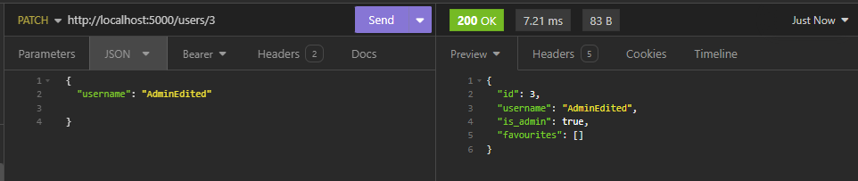

# Game Review API

## How To Run

1. Create a new postgresql user and give permissions
2. Create a postgresql database (blog_api)
3. Edit ".env" file so "SQL_DATABASE_URI" matches user and database details
4. Start python virtual environment (python3 -m venv venv)
5. Activate virtual environment **Windows:(source venv/Scripts/activate)**, **MacOS(source venv/bin/activate)**
6. Install requirements (pip install -r requirements.txt) or rename other attached requirements file to requirements.txt and try again if it doesnt work
7. Create and seed tables (flask db drop && flask db create && flask db seed)
8. Run flask app (flask run)


## What does this API solve? and why solve it?

To answer that we first have to understand what does the API do. The Game Review API itself aims to be a social platform that allows users to simply create profiles and share what games they think are good, bad or ugly. Users can do this through using endpoints that allow the creation of reviews and favourites. Games & developers are also manually added by users, with the end goal to create an ever-growing database that dynamically changes as time goes on.

While I don't think the problem I'm solving is particularly massive I still think its an issue. Steam is the biggest pc gaming store on the market with its closest competitor being the Epic Games Store. These stores are massive and honestly take up a majority of the online gaming market space. In reality these stores are detatched and are quite depersonalized and are quite a leap from what the gaming ecosystem used to be - When you would buy a new game on a sunday night and spend the night before school up until demon hours frothing at mouth at how much you want to tell your friends to get it so that you guys can play together. When looking at things like Steam and Epic the main place where we get these games, it really lacks the ability to show what games you actually enjoy and what your friends enjoy. It has a certain clutter about it. This API at least tries to being back that sunday night joy and that more personalized feeling by allowing users to just simply show what games they like, and if they find a new game add it to the database and leave a review for others to find. The API itself allows for a simple and easy way to access users/friends profiles to see what games they have been enjoying recently. Overall this is just a long winded way of saying, I want to make sharing games with friends and other people a focus like it used to be.

Is this a problem that needs solving? Look probably not, at least for everyone. I think a lot of people share my sentimental views. I think a API like acts as a problem solver for those people. As I said I want the API to feel more personal, like an indie project, in comparison to something like Steam. Steam is overwhelming and a lot of the time slugglish. This gives people who share this view a place to ignore the fluff and focus on what is important to them about playing games.


## Endpoints

## Auth

### Register


Description: Creates new a new user.

Restrictions:
```python
    username = fields.String(required = True, validate = Length(min = 1))
    password = fields.String(required = True, validate = Length(min = 4)) 
```

### Login


Description: User logs in if has correct credentials 

Restrictions:
To log in a username and password must match a entry in the user table

## User Table

### Get User/s


Description: Returns all users or a specified user

### Delete User


Description: Delete user

Restriction: User_id must be the same url user_id


### Edit User




Description: Edit user

Restriction: User_id must be the same url user_id

---

## Developer Table

### Get Dev/s


Description: Returns all developers or just a singular

### Create Dev


Description: Create developer instance

Restrictions:
```python
    name = fields.String(required = True, validate = Length(min = 1))
```

### Delete Dev


Description: Delete developer


### Edit Dev


Description: Edit developer

---

## Game Table

### Get Game/s


Description: Returns games

### Create Game


Description: Create game model instance

### Delete Game


Description: Delete game instance

### Edit Game


Description: Edit game instance

---

## Favourite Table

### Get Favs


Description: Get a users favourites

### Create Fav


Description: Create favourite instance connected with user

### Delete Fav


Description: Delete favourite instance

### Edit Fav


Description: Edit favourite instance

---
## Review Table

### Get Reviews


Description: Gets reviews of associated game

### Create Review


Description: Creates review instance linked to associated game

### Edit Review


Description: Edits Review instance

### Delete Review


Description: Deletes review instance

---

## Database System

Apart from the obvious reason of using PostgreSQL over alternatives like MongoDB, because we were taught it. PostgreSQL bides on its adherence to the ACID principles that ensure integrity and reliablity of a database. Systems such as Mongodb(a NoSQL database), while improving tend to struggle at maintaining the principles as strictly. When creating a database I wanted a system that abided by these principles. While MongoDB is known for its scalability it was not simply as desireable  as the API im working with probably wont have have massive need for scale. MongoDB's main advantage over PostgreSQL for this specific database would be Mongo's inherently faster quiery times. While previously said the scalability wasnt a massive draw it still important to note that this API will scale based on interest from users, which may in toe create that need for scale.

## What is an ORM?
An ORM or Object Relational Mapping aims to allow developers to use a programming language instead of directly using SQL to maintain, develop and edit databases. At its core it convert objects into a form that is able to be stored within a database. Flask SQLAlchemy is the ORM used in this API. ORM's do alot of stuff by themselves in the backend requiring developers to not code stuff relating to database -> server handling. Sanitizing the data becomes incredibly easy as well.

## Third Party Services

### Flask
    Flask is a web framework written in python that offers inbuilt libaries and tools that allow developers to create API's fast and effectively.

### SQLAlchemy
    SQLAlchemy is the projects ORM that allows users to create python objects that then can be made into corresponding sql objects like tables and columns. It allows us to create different queiries in the same syntax of Python, making it easier for someone like myself who is learning python
### Psycopg2
    Psycopg2 acts as the translator between Python and the database itself and s used to connected the database and the created app. Psycopg2 also has an inbuilt libary for errorcodes which is extensively used within the app.
### Flask JWT EXTENDED
    Flask-JWT-EXTENDED is in charge of providing and validating JWT tokens. JWT tokens are used as user authentication within the app
### Flask Bcrypt
    Bcrypt in this app was used to encrypt and verify user passwords.
### Marshmallow
    Marshmallow was extensively used within in the app declaring each of the different tables schemas. It helps control what the valid inputs are as well as helping to show what we want when returning the schemas
## ERD


## Relationships and Models

### User Model
```python
class User(db.Model):
    __tablename__ = "users"

    # Model 
    id = db.Column(db.Integer, primary_key = True )
    username = db.Column(db.String, nullable = False, unique=True)
    password = db.Column(db.String, nullable = False)
    is_admin = db.Column(db.Boolean, default = False)

    favourites = db.relationship('Favourite', back_populates = 'user', cascade = 'all, delete')
    reviews = db.relationship('Review', back_populates = 'user', cascade = 'all, delete')
```
This model represents our user and it stores a users username and password which then can be used to login to the API. When looking at the ERD we can see that user has direct relationships with both Review and Favourite tables. These two tables can only be influenced by a user who is logged in and has a valid JWT. User table has a many to relationship with both tables.


### Developer Model

```python
class Developer(db.Model):

    __tablename__ = "developers"

    id = db.Column(db.Integer, primary_key=True)
    name = db.Column(db.String(25), nullable=False, unique = True)
    date_founded = db.Column(db.Date)

    games = db.relationship('Game', back_populates = 'developer', cascade = 'all, delete')

    __table_args__ = (
        CheckConstraint('date_founded < CURRENT_DATE', name='check_future'),
    )
```

This model represent the Developer table and it stores the name and date it was founded. This table is only directly connected to the games table and its main purpose is to allow users to do a query search for games a develeloper has made. The relationship when referencing the erd is one to many, as a game can only have on developer but a developer can have many games.

### Game Model

```python
class Game(db.Model):
    __tablename__ = "games"

    # Model
    id = db.Column(db.Integer, primary_key=True)
    title = db.Column(db.String(255), nullable=False, unique = True)
    description = db.Column(db.Text)
    genre = db.Column(db.String(20))
    publisher = db.Column(db.String(25))
    release_date = db.Column(db.Date, nullable=False)

    developer_id = db.Column(db.Integer, db.ForeignKey('developers.id'), nullable=False)

    developer = db.relationship('Developer', back_populates = 'games')
    favourites = db.relationship('Favourite', back_populates = 'game', cascade = 'all, delete')
    reviews = db.relationship('Review', back_populates = 'game', cascade = 'all, delete')
    
    # CheckConstraint to ensure release_date is in the past
    __table_args__ = (
        CheckConstraint('release_date < CURRENT_DATE', name='check_future'),
    )
```

The game model represents how we store each game in the database. The model stores information like the title, a custom description, genre, publisher, release date and the FK developer. The table itself is related to both the review and favourites tables as well.

### Review Model 

```python
class Review(db.Model):
    __tablename__ = "reviews"

    id = db.Column(db.Integer, primary_key = True)
    rating = db.Column(db.Integer, nullable = False)
    date_made = db.Column(db.Date, default=db.func.current_date())
    completed = db.Column(db.Boolean, default = False)
    content = db.Column(db.Text)


    user_id = db.Column(db.Integer, db.ForeignKey('users.id'), nullable = False)
    game_id = db.Column(db.Integer, db.ForeignKey('games.id'), nullable = False)

    user = db.relationship('User', back_populates = 'reviews')
    game = db.relationship('Game', back_populates = 'reviews')

    __table_args__ = (
        db.CheckConstraint('rating >= 0 AND rating <= 10', name='check_rating_range'),
    )
```
The review model acts as a way to allow users to leave feedback on games. The review model has direct relations with the user table and the game table as to tell who is leaving the review and what are they leaving the review on. Both being many-one relationships as a game can have many favourites and reviews but every favourite and review can only belong to one game.

### Favourite Model

```python
class Favourite(db.Model):
    __tablename__ = "favourites"

    id = db.Column(db.Integer, primary_key = True)

    user_id = db.Column(db.Integer, db.ForeignKey('users.id'), nullable = False)
    game_id = db.Column(db.Integer, db.ForeignKey('games.id'), nullable = False)

    user = db.relationship('User', back_populates = 'favourites')
    game = db.relationship('Game', back_populates = 'favourites')
```
The favourite model acts as a way to allow users to favourite certain games that they deem worth. The model itself much like the review model shares the same type of relationships.


## Overall database relation
The database general relation is that users can add games to their favourites which then can been seen by other users through a get endpoint shown above. Users can also create reviews on games they want. These reviews can also be viewed by going to the gameid/review endpoint. Users are only able to edit things that they themselves have created. The games table acts as the glue that allows these actions to take place. The developer table is added as it enables different quieries. 


## Planning and Tracking

Much like the previous terminal assessment I used an app called Height due to its pretty nifty tools such as AI and different views. The last week had minimal progress causing me to fall behind. Overall this had caused a lack of quality especially in regards to the readme.


